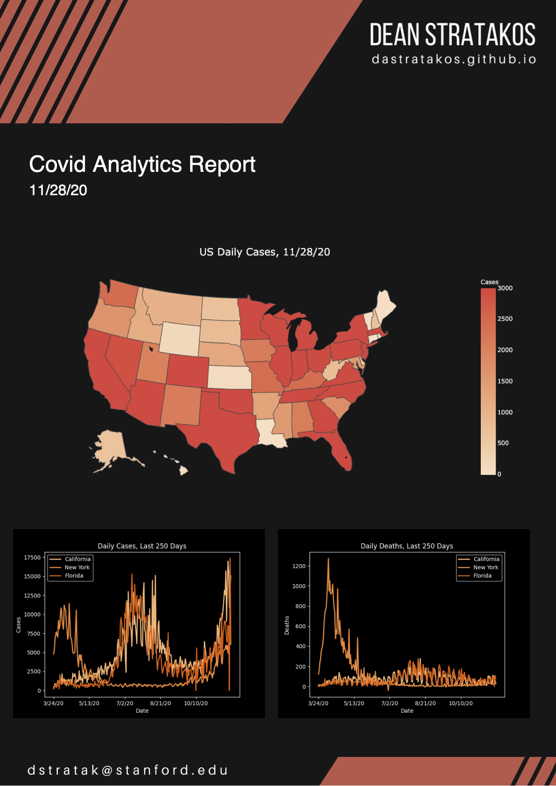
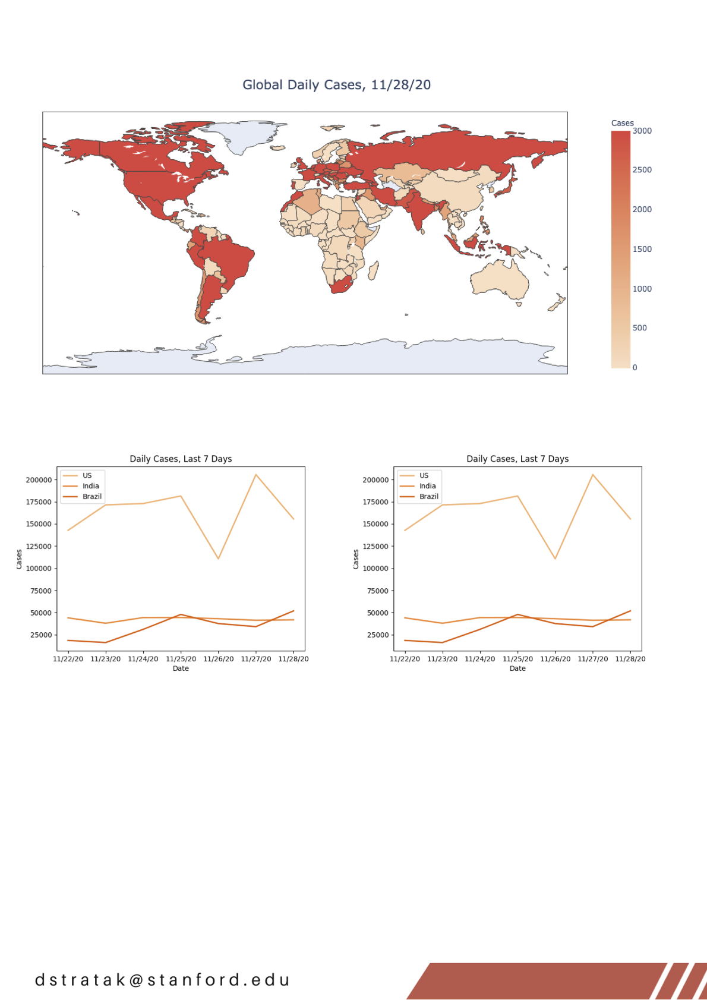

# COVID-19 Report Generator

## Dean Stratakos
### November 27, 2020

**COVID-19 Report Generator** creates an analytics report 

Time spent: **15** hours spent in total

## Functionality 

The app supports the following functionality:
- [x] The script creates a nicely stylized and formatted three page  PDF report
with real-time COVID-19 statistics based on the files at this
[GitHub link](https://raw.githubusercontent.com/CSSEGISandData/COVID-19/master/csse_covid_19_data/csse_covid_19_time_series/).
- [x] The user can pick between a light and dark theme.

## Screenshots

Page One with the dark theme:



Page Three with the light theme:



## Usage

Install the required packages using `pip`, and make sure to use Python 3.

```sh
python generate_report.py
```

## Resources

I followed along with this [YouTube video](https://youtu.be/UmN2_R4KEg8) and
forked this [GitHub repo](https://github.com/KeithGalli/generate-analytics-report.git).
The data comes from this [GitHub directory](https://raw.githubusercontent.com/CSSEGISandData/COVID-19/master/csse_covid_19_data/csse_covid_19_time_series/).
I used this [Canva template](https://www.canva.com/templates/EADanhu4gjA-grey-lines-geometric-shapes-architecture-company-letterhead/) for the PDF.

## Future work
- [ ] Plot a rolling average of the cases to create a smoother graph.
- [ ] Explore displaying different graphs.

## License

    Copyright 2020 Dean Stratakos

    Licensed under the Apache License, Version 2.0 (the "License");
    you may not use this file except in compliance with the License.
    You may obtain a copy of the License at

        http://www.apache.org/licenses/LICENSE-2.0

    Unless required by applicable law or agreed to in writing, software
    distributed under the License is distributed on an "AS IS" BASIS,
    WITHOUT WARRANTIES OR CONDITIONS OF ANY KIND, either express or implied.
    See the License for the specific language governing permissions and
    limitations under the License.
